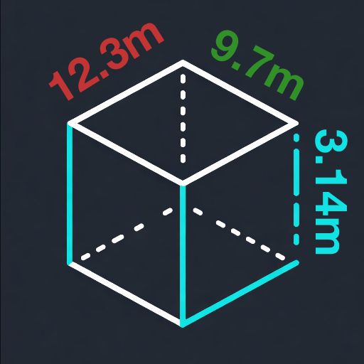
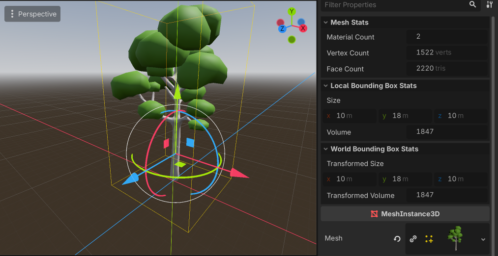

# Mesh Inspector Addon for Godot

An addon for Godot that displays some helpful stats about the
currently selected MeshInstance3D or Mesh.

### Installing

1. Open your project in Godot and go to the Asset Library tab at the top.
2. Search for "mesh inspector" to find the addon
3. Choose Download to install it in your addon's folder
4. Go to "Project -> Project Settings... -> Plugins" and enable the newly installed plugin

or, to manually install it...

1. Download the code from Github at https://github.com/rikh42/meshinspector
2. Unzip and copy the 'addons' folder into your project
3. reload Godot
4. Go to "Project -> Project Settings... -> Plugins" and enable the newly installed plugin

### Using it.

Just select any MeshInstance3D or Mesh and some new stats will be
shown in the inspector (on the right by default).

You'll get to see:-
- Number of materials in the mesh
- Vertex count
- Face Count
- Bounding box size (width, height and depth of the mesh)
- Volume of the mesh

For MeshInstance3D's, you'll also be able to see the bounding box
and volume of the transformed version of the mesh (for example, if
the mesh has a global transform applied that scales it in some way).

_A scene with a tree mesh selected, showing it's size and vertex count_

Any bugs or queries, find me on Blue Sky at [@gamehooe.bsky.social](https://bsky.app/profile/gamehooe.bsky.social)
